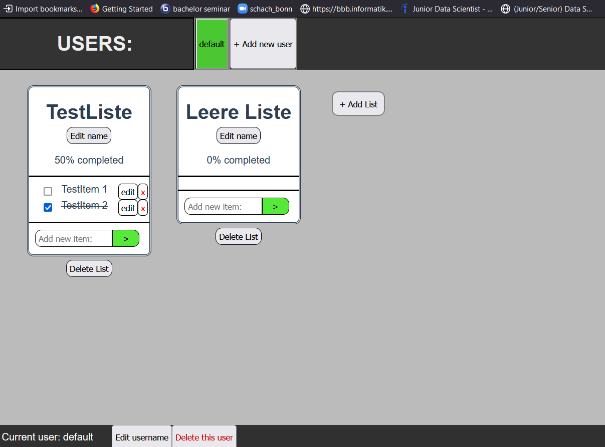

# To-do-list

This is a VUE application that was written in the context of my university education.
It contains all of the CRUD functions (creating, reading, updating and deleting) which makes it a good project to start with web apps.

Instructions are in the README files of both client and server folders. 
To run the app on your local browser (localhost:3000), navigate to the server folder and execute 'npm start' in the command line.

A preview of the layout:

  

